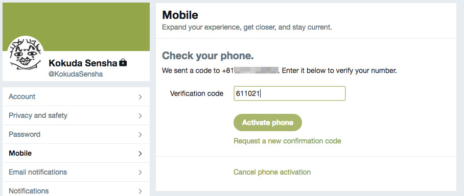

# How to make mikutter work again

IT IS "NOT" OFFICIAL DOCUMENT OF MIKUTTER PROJECT OR TWITTER. DO NOT CONTACT TO @TOSHI_A AND TWITTER INC.

## Get Consumer key

* ALL STEPS REQUIRED!!
* Required environments/items
    * PC Web browser
    * Mobile phone that can use SMS

### Register your mobile phone to twitter account

1. Open your Web browser
2. Access [Twitter account settings page](https://twitter.com/settings/)
3. Open ["Mobile"](https://twitter.com/settings/add_phone)
4. Set your mobile phone number.


5. Twitter send verify code (6-digits) to your phone then input it.



6. If you added your phone successfully, Twitter shows "Your phone is activated!".


### create app

1. Access [Twitter Apps](http://apps.twitter.com/)
2. Click "Create New App"


3. Input app information
    * Name: your app name
        * YOU CANNOT USE "mikutter". mikutter is already taken for Name.
    * Description: Sloppy strings ;-)
    * Website: Sloppy URL or your website


4. Agree Developer Agreement
5. Click "Create your Twitter application"
6. Open "Permissions" tab on the moved application settings page.
7. Change "Access" to "Read, Write and Access direct messages".
8. Click "Update Settins"


9. Open "Keys and Access Tokens".
10. Copy the "Consumer Key" and the "Consumer Secret".


## mikutter configuration

This step differs depending on the version using mikutter!!

### Case of you using mikutter greater than version 3.7 (RECOMMENDED)

You can change consumer key and consumer secret by 3rd party(but made by toshi_a) plugin named ["twitter_api_keys"](https://github.com/toshia/twitter_api_keys).

1. Open terminal app.
2. Put below command to install twitter_api_keys plugin.

```
$ mkdir ~/.mikutter/plugin/; git clone https://github.com/toshia/twitter_api_keys.git ~/.mikutter/plugin/twitter_api_keys
```

3. Open the plugin file with text editor you like.

```
$ vi ~/.mikutter/plugin/twitter_api_keys/twitter_api_keys.rb
```

4. Paste "Consumer Key" and the "Consumer Secret" here.

```
(ORIGINAL CODE)
  # 以下の'から'の間に、Consumer Key(APIKey)を入れる
  consumer_key = ''
  # 以下の'から'の間に、Consumer Secret(APISecret)を入れる
  consumer_secret = ''
```
```
(TRANSLATED AND EXAMPLE)
  # Put the Consumer Key(APIKey) below into the single quote.
  consumer_key = 'uqrItd0YPTARVBOBILLARuW4B'
  # Put the Consumer Secret(APISecret) below into the single quote.
  consumer_secret = 'dcQuDiro1Z41xPynWoo8YtGLuCUpLqOBs6ymEJEuiiino8c1O0'
```

5. Save it.

### Case of you using mikutter less than version 3.7

If you using mikutter up to version 3.6.x, you cannot use above plugin. You should change the source code of mikutter directly.

1. Open config.rb with text editor you like.

```
$ vi /path/to/mikutter/core/config.rb
```

2. change below lines.

```
(ORIGINAL)
  # 下の２行は馬鹿にしか見えない
  TWITTER_CONSUMER_KEY = "PYO0IZRiGsBrKmVTMmyh8A4lv"
  TWITTER_CONSUMER_SECRET = "VFTfQrYDVrNUvYcSV6fDDSc5CBsFnXMCaYoRYdMuJDERwcYzL7"
```

```
(EXAMPLE)
  # 下の２行は馬鹿にしか見えない
  TWITTER_CONSUMER_KEY = "uqrItd0YPTARVBOBILLARuW4B"
  TWITTER_CONSUMER_SECRET = "dcQuDiro1Z41xPynWoo8YtGLuCUpLqOBs6ymEJEuiiino8c1O0"
```

3. Save it.

## Account Settings on the mikutter

1. Run mikutter
2. Open Settings
3. Open "Accounts"
4. If you find twitter account settings, Read below "If already added twitter account(s) in the mikutter" section.
5. Click add
6. Follow the wizard instructions to add twitter account to mikutter.

### If already added twitter account(s) in the mikutter

After changed consumer key, you SHOULD remove the ALL twitter account settings from the mikutter once.

# License

The MIT License

Copyright 2018 @Akkiesoft

Permission is hereby granted, free of charge, to any person obtaining a copy of this software and associated documentation files (the "Software"), to deal in the Software without restriction, including without limitation the rights to use, copy, modify, merge, publish, distribute, sublicense, and/or sell copies of the Software, and to permit persons to whom the Software is furnished to do so, subject to the following conditions:

The above copyright notice and this permission notice shall be included in all copies or substantial portions of the Software.

THE SOFTWARE IS PROVIDED "AS IS", WITHOUT WARRANTY OF ANY KIND, EXPRESS OR IMPLIED, INCLUDING BUT NOT LIMITED TO THE WARRANTIES OF MERCHANTABILITY, FITNESS FOR A PARTICULAR PURPOSE AND NONINFRINGEMENT. IN NO EVENT SHALL THE AUTHORS OR COPYRIGHT HOLDERS BE LIABLE FOR ANY CLAIM, DAMAGES OR OTHER LIABILITY, WHETHER IN AN ACTION OF CONTRACT, TORT OR OTHERWISE, ARISING FROM, OUT OF OR IN CONNECTION WITH THE SOFTWARE OR THE USE OR OTHER DEALINGS IN THE SOFTWARE.